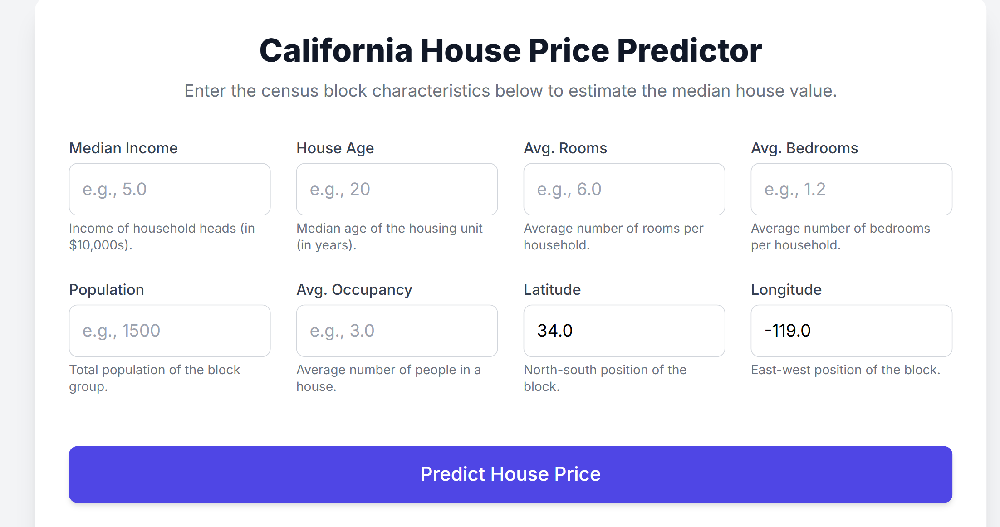
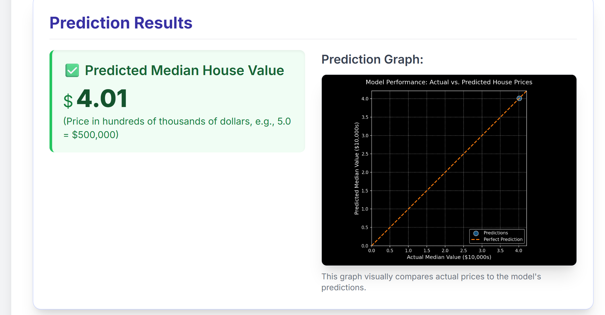

# California House Price Predictor

## 🏠 Project Overview

This is a web application designed to predict the median house value for a given census block in California, based on key demographic and geographical input features. The underlying model is typically trained on the famous California Housing dataset.

The interface is built using pure HTML, JavaScript, and styled with Tailwind CSS for a responsive and modern look.


## 📸 App Preview



*Web app homepage for user input*


*Scatter plot showing Actual vs Predicted Prices*

## ✨ Features

* **Responsive UI**: Fully functional and aesthetically pleasing on desktop, tablet, and mobile devices.
* **Real-time Input Validation**: Client-side JavaScript prevents users from entering imaginary values (like exponential notation 'e') and enforces non-negative inputs for relevant fields (Income, Age, Population, etc.).
* **Sanity Check Warning**: Includes logic to display a warning if the predicted median house value falls outside a reasonable range (e.g., predicted value < $0 or > $500,000, assuming the prediction is in $10,000s).
* **Visual Results**: Displays the predicted price prominently alongside a visualization (e.g., a graph comparing actual vs. predicted values) for context.

## 🛠️ Usage

To get a price prediction, input the following eight variables into the form:

1. **Median Income (MedInc)**: Income of household heads in the block group (in $10,000s).
2. **House Age (HouseAge)**: Median age of the housing unit (in years).
3. **Average Rooms (AveRooms)**: Average number of rooms per household.
4. **Average Bedrooms (AveBedrms)**: Average number of bedrooms per household.
5. **Population (Population)**: Total population of the block group.
6. **Average Occupancy (AveOccup)**: Average number of people in a house.
7. **Latitude (Latitude)**: North-south geographical position.
8. **Longitude (Longitude)**: East-west geographical position.

Click the **"Predict House Price"** button to submit the data to the backend.

## ⚠️ Sanity Check

The application includes a server-side sanity check based on the function `check_prediction_reasonable(prediction)`:

* If the prediction is less than $0, a warning is displayed.
* If the prediction is greater than $50 (i.e., $500,000), a warning is displayed, suggesting the input values should be reviewed.

## 🤖 About the Model

### Sample Model (Included)

This repository includes a **sample model** (`models/random_forest_log_model.pkl`) trained on a small subset of the California Housing dataset. This lightweight model is included for:

- ✅ Easy setup and testing
- ✅ Demonstration purposes
- ✅ Quick deployment without downloading large files

**Important:** The sample model has limited accuracy and is NOT suitable for production use.

### Production Model (Not Included)

The original full-scale production model is **excluded from version control** due to its large size. To use your own production model:

1. Train your model on the complete California Housing dataset
2. Save it as `models/random_forest_log_model.pkl`
3. The application will automatically use your model

For large models (>100MB), consider using Git LFS for version control.

## 🖥️ File Structure

```
california-house-predictor/
├── main.py                          # Flask backend application
├── models/
│   └── random_forest_log_model.pkl # Sample model (included)
├── templates/
│   └── index.html                  # Frontend interface
├── requirements.txt                # Python dependencies
├── .gitignore                      # Git ignore rules
├── LICENSE                         # MIT License
├── README.md                       # This file
```

## Download Trained Model
The trained model used in this project can be downloaded here:  
[Download Model](https://drive.google.com/file/d/17gJSJSdHc8dAgHoEyQPyiIwIwSb6TLjI/view?usp=sharing)


## ⚙️ Dependencies

### Backend
- Flask
- pandas
- numpy
- matplotlib
- scikit-learn
- joblib

### Frontend
The frontend only requires an internet connection to load the following external resources:
* **Tailwind CSS CDN**: For all styling and responsiveness.
* **Inter Font**: For modern typography.

## 🚀 Installation & Setup

### 1. Clone the Repository

```bash
git clone https://github.com/YOUR_USERNAME/california-house-predictor.git
cd california-house-predictor
```

### 2. Create Virtual Environment

```bash
# Create virtual environment
python -m venv venv

# Activate virtual environment
# On Windows:
venv\Scripts\activate
# On macOS/Linux:
source venv/bin/activate
```

### 3. Install Dependencies

```bash
pip install -r requirements.txt
```

### 4. Run the Application

```bash
python app.py
```

The application will be available at `http://127.0.0.1:5000`

## 📊 Expected Input Ranges

* **Median Income**: Typically 0.5 - 15.0 (in $10,000s)
* **House Age**: 1 - 52 years
* **Average Rooms**: 1 - 10 rooms per household
* **Average Bedrooms**: 0.5 - 5 bedrooms per household
* **Population**: 3 - 35,000 people
* **Average Occupancy**: 1 - 10 people per house
* **Latitude**: 32.5 - 42.0 (California range)
* **Longitude**: -124.5 - -114.0 (California range)

## 📝 Notes

* The prediction output is in units of $10,000s (e.g., a prediction of 2.5 means $25,000)
* All input validations are performed both client-side and server-side
* The sanity check threshold of $500,000 can be adjusted based on your specific use case
* Generated plots are saved to the `static/` directory

## 🤝 Contributing

Contributions are welcome! Please feel free to submit a Pull Request.

1. Fork the repository
2. Create your feature branch (`git checkout -b feature/AmazingFeature`)
3. Commit your changes (`git commit -m 'Add some AmazingFeature'`)
4. Push to the branch (`git push origin feature/AmazingFeature`)
5. Open a Pull Request

## 📄 License

This project is open source and available under the MIT License. See the `LICENSE` file for more details.

## 🔗 Resources

- [California Housing Dataset](https://scikit-learn.org/stable/modules/generated/sklearn.datasets.fetch_california_housing.html)
- [Flask Documentation](https://flask.palletsprojects.com/)
- [Tailwind CSS](https://tailwindcss.com/)
- [scikit-learn](https://scikit-learn.org/)

## 📧 Contact

For questions or feedback, please open an issue on GitHub.

---

**Note:** Remember to replace `YOUR_USERNAME` in the clone URL with your actual GitHub username.
